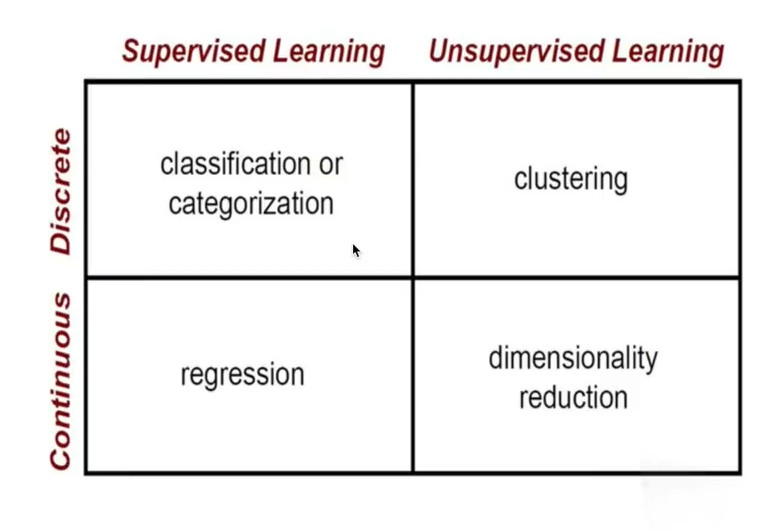

# Supervised learning vs Unsupervised learning
## Supervised learning
 - More accurate
 - Labeled data required
 - Requires human in the loop

## Unsupervised learning
 - Less accurate
 - No labelled data required
 - Minimal human effort

# Clustering
*Clustering* represents a typical and well-known type of unsupervised learning. Clustering algorithms try to find natural groupings in data. Similar data points are considered in the same group. We call these groups clustes.

## K means clustering
## Elbow method for retrieving the K value
## Euclidian distance

**numpy** is for matrix math  
**matplotlib** is for graphing
