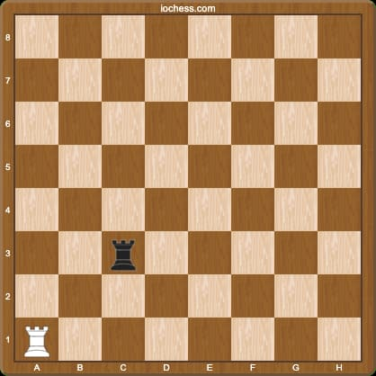

A recursive function represents a function that calls itself during its execution. This enables the function to iterate its code several times, outputting the result and the end of each iteration. Recursion embodies a way of solving a problem splitting the solution into smaller instances of the same problem. The approach can be leveraged and applied to many types of problems.

A classical recursive function is the factorial function. Here's an example written in [javascript][javascript]:

```javascript
function factorial(n) {
  if (n == 0 || n == 1) {
    return 1;
  }
  return factorial(n - 1) * n;
}
```

## Chessboard challenge

Let's have a look to something more sophisticated like a custom [chessboard][chessboard] game. Suppose to have a [rock][rock] on an empty chessboard. The rock can only move **up** or **right**, one tile at a time. Start position is A{x, y}, finish position is B{x, y}. Considering these initial constraints `A.x < B.x` and `A.y < B.y`, count all the possibile unique paths from point A to point B.



Here's the javascript code that will solve this chessboard game challenge:

```javascript
const solve = (A, B) => {
  let pathNum = 0;
  let paths = {};

  const calcPathMove = (x, y, cue = []) => {
    let tmpCue = cue.slice();
    tmpCue.push([x, y]);

    if (x === B.x && y === B.y) {
      paths[pathNum] = tmpCue;
      pathNum++;
      return;
    }

    if (x < B.x) {
      calcPathMove(x + 1, y, tmpCue);
    }

    if (y < B.y) {
      calcPathMove(x, y + 1, tmpCue);
    }
  };

  calcPathMove(A.x, A.y);

  return { pathNum, paths };
};
```

If we consider the initial position to be `{ x: 0, y: 0 }` and the final position to be `{ x: 2, y: 2 }`, the computed number of possible unique paths will be 6.

```javascript
let a = { x: 0, y: 0 };
let b = { x: 2, y: 2 };
const { pathNum, paths } = solve(a, b);

console.log({ pathNum });
console.log(paths);
```

As a bonus the function will keep track and store all the different path movements.

[javascript]: https://en.wikipedia.org/wiki/JavaScript
[chessboard]: https://en.wikipedia.org/wiki/Chessboard
[rock]: https://en.wikipedia.org/wiki/Rook_(chess)